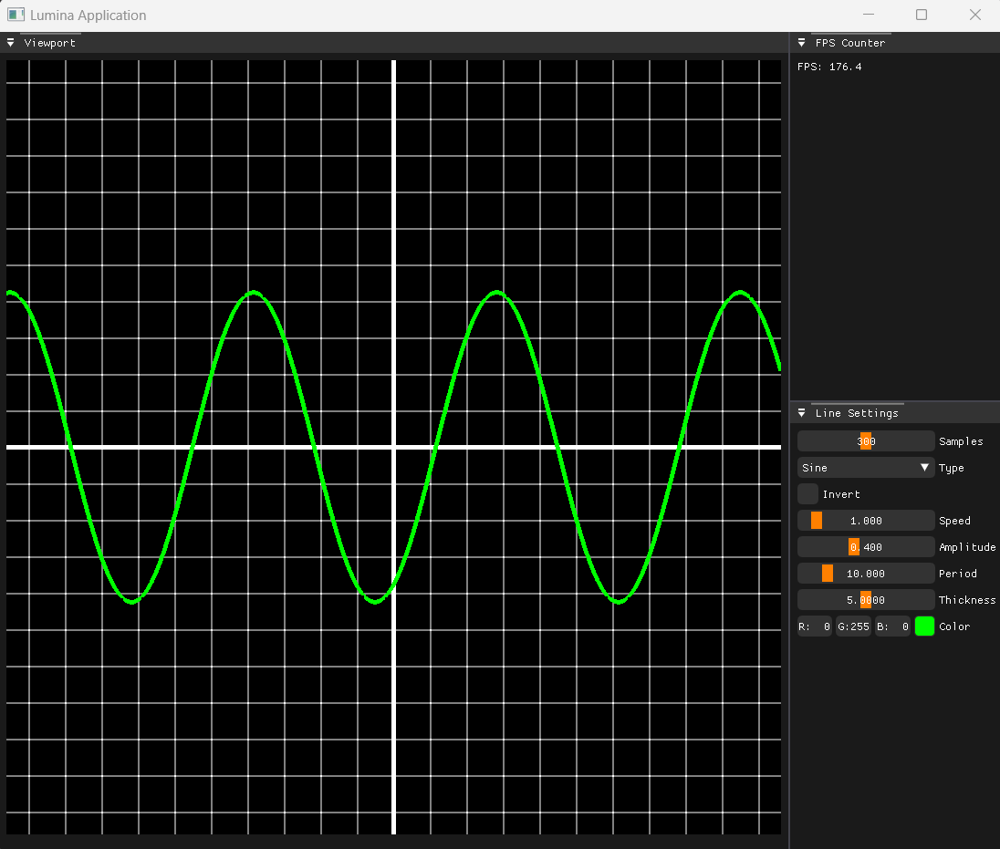
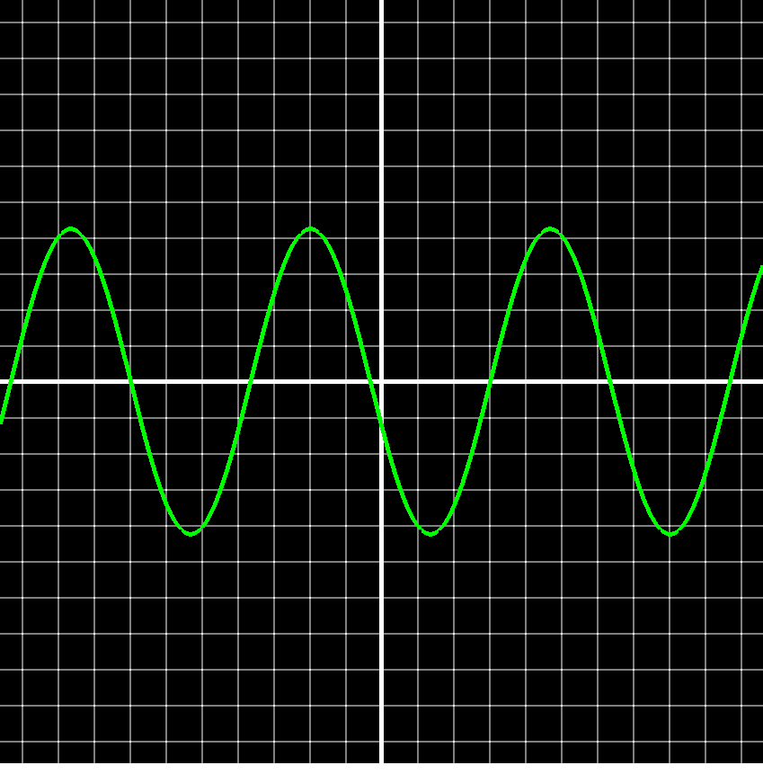
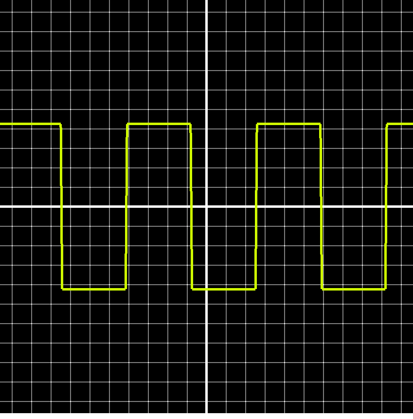
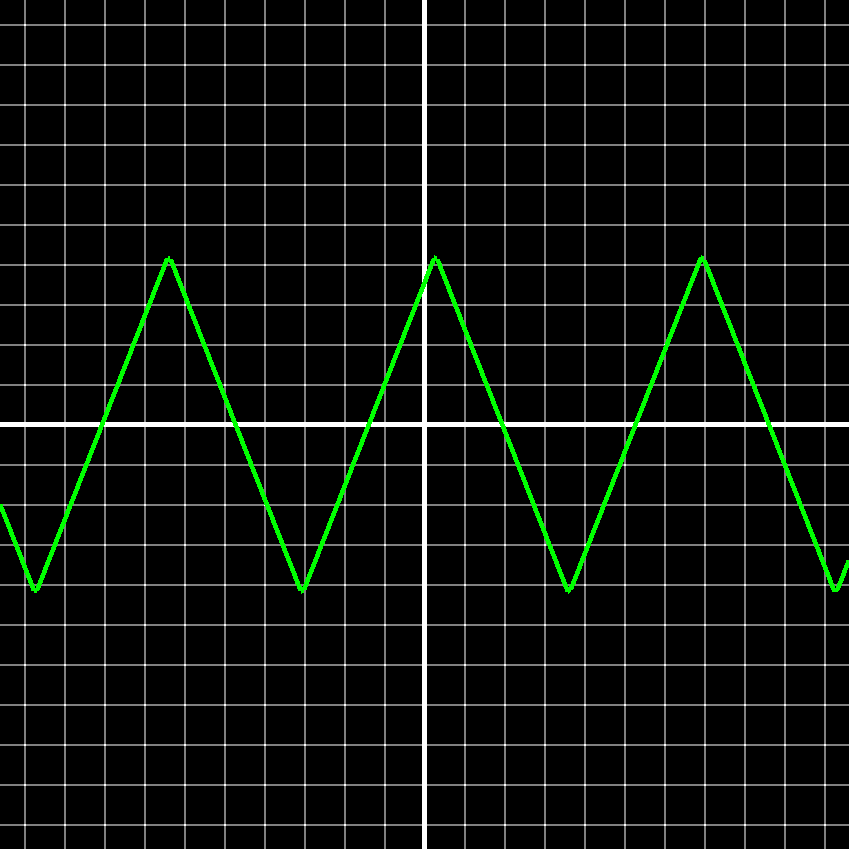
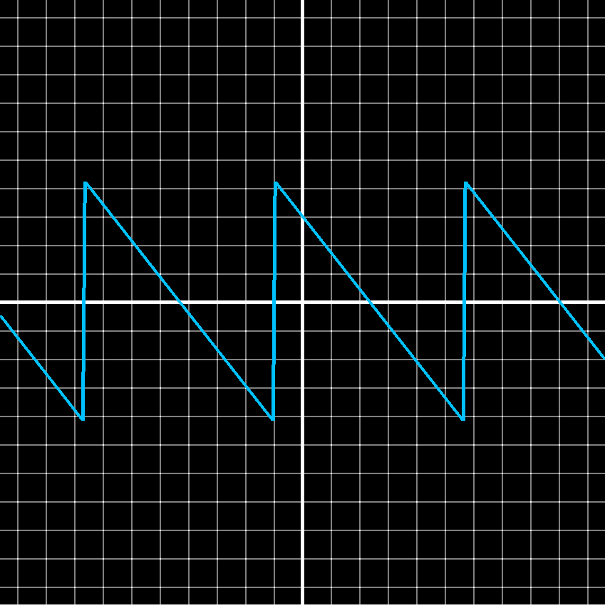
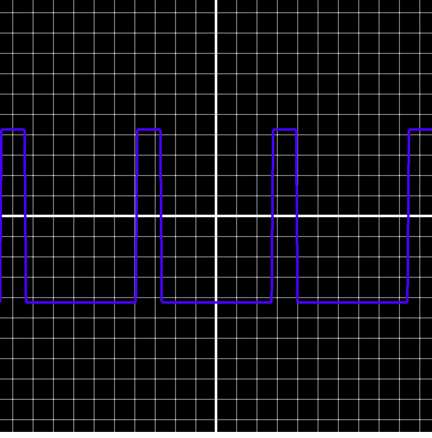
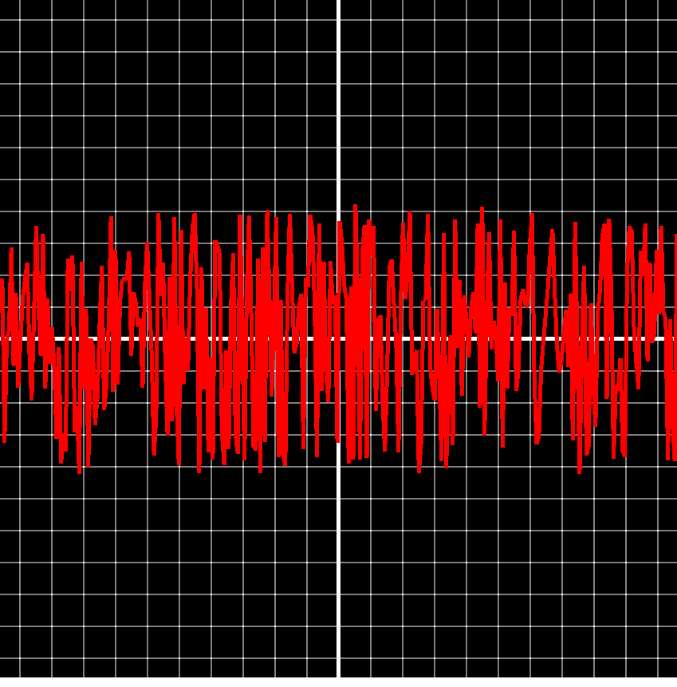
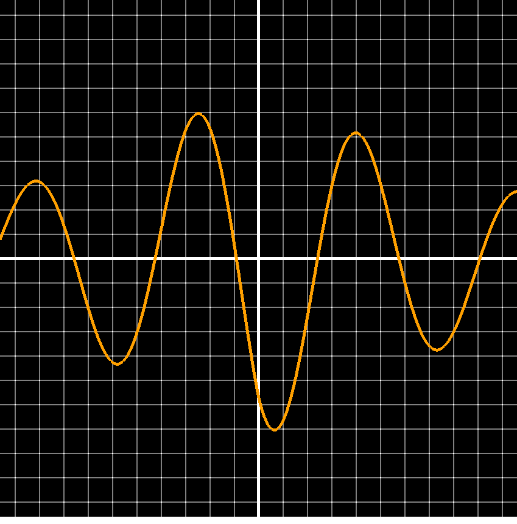

# Wave Visualizer

<p align="center">
  
</p>

---

**Wave Visualizer** is a dynamic real-time waveform rendering tool built using the custom C++ application framework [Lumina](https://github.com/stephen-os/Lumina). It allows users to display and interact with a variety of waveforms such as sine, square, triangle, exponential, and more.

## ✨ Features

- 🎛️ Real-time waveform rendering with customizable parameters
- 🔁 Supports multiple waveform types:
  - Sine
  - Cosine
  - Square
  - Triangle
  - Sawtooth
  - Pulse (with duty cycle control)
  - Noise
  - Exponential decay
  - Absolute Sine
- ⚙️ Adjustable properties:
  - **Amplitude**
  - **Speed**
  - **Period**
  - **Line Thickness**
  - **Sample Count**
  - **Color**
- 🔄 Waveform inversion toggle
- 🧰 Built entirely with [Lumina](https://github.com/stephen-os/Lumina), my custom C++ application rendering framework

---

## 📊 Waveform Types

Below are examples of each waveform that can be visualized in the application:

<p align="center"><strong>Sine Wave</strong></p>
<p align="center">
  
</p>

<p align="center"><strong>Square Wave</strong></p>
<p align="center">
  
</p>

<p align="center"><strong>Triangle Wave</strong></p>
<p align="center">
  
</p>

<p align="center"><strong>Sawtooth Wave</strong></p>
<p align="center">
  
</p>

<p align="center"><strong>Pulse Wave</strong></p>
<p align="center">
  
</p>

<p align="center"><strong>Noise Wave</strong></p>
<p align="center">
  
</p>

<p align="center"><strong>Exponential Wave</strong></p>
<p align="center">
  
</p>

---

## 🛠️ Built With

This project is built using the [Lumina](https://github.com/stephen-os/Lumina) framework — a custom C++ application and rendering engine that simplifies OpenGL development while supporting modern rendering patterns.

---

## 🧪 Running the Project

1. Clone the repository with all dependencies:
   ```sh
   git clone --recursive https://github.com/stephen-os/frequency-visualiser.git
   ```
2. Navigate to the `scripts` folder and run the `Setup` script.
3. Open the `.sln` file in Visual Studio 2017 or later.
4. Build and run the project from Visual Studio.